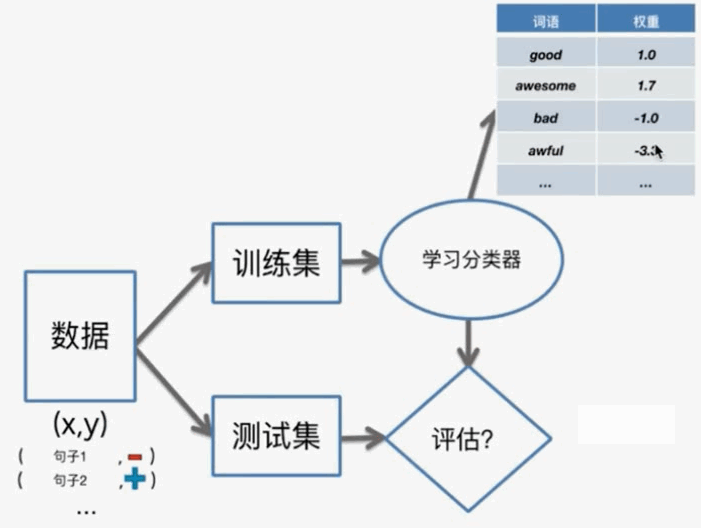

# Scikit-Learn Introduction

大纲:
- 回归模型: 数据→回归→智能, example: 房价预测
  - 线性回归
  - 多项式回归
- 分类模型: 数据→分类→智能, example: 情感分析
- 聚类模型: 数据→聚类→智能, example: wiki文本分析
- 推荐系统: 数据→协同过滤→智能, example: 音乐推荐系统
- 深度学习: 数据→深度学习→智能, example: 图像检索系统

Environment:
- pandas, scikit只能处理内存中的数据, 不能应用于大型的数据集
- sframe, graphlab create不仅能够处理内存中的数据集还可以处理大型数据集

## Regression model

example
- 房价:
  - 面积
  - 几室几厅
  - ...
- 学习成绩
  - 预习时间
  - 学习时间
  - 复习时间
  - 练习时间
- 股票价格
  - 近期股价
  - 新闻事件
  - 相关的商品
- 微博流行度
  - 粉丝数
  - 粉丝的粉丝数
  - 微博内容
  - 转发频率
- 预测房间空间某一点的温度
  - 现在的时间
  - 室外的温度
  - 其他传感器的温度
  - 通风口
  - ...

## classification

example
- 情感分析、评价打分
  - input: 文本内容
  - output: 正面、负面
- 新闻类别分类
  - input: 新闻内容
  - output: 新闻类别
- 垃圾邮件过滤
  - input: ip, sender, 邮件内容
  - output: 正常邮件、垃圾邮件
- 图像识别
  - input: pixel info
  - output: 名称
- 医疗诊断
  - input: 各种测试数据, DNA
  - output: 疾病种类
- 读懂正在想的内容
  - input: 核磁成像
  - outpu: 东西种类

阈值分类器: 统计正面和负面的单词个数
- if 正面个数>负面个数: 正面
- else: 负面

阈值分类器缺点:
- 无法区分单词不同程度: e.g. Great > Good
  - 通过学习分类器实现
- 单独的词语不够: e.g. not good
  - 通过更多特征解决

线性分类器:
- 对不同的单词加入权重，然后简单求和
  - if 求和>0: 正面
  - else: 负面

决策边界: 区分了正面和负面的预测
> 
- 两个非零权重，线性分类器，决策边界时直线
- 三个非零权重，线性分类器，决策边界时平面
- 多个非零权重，线性分类器，决策边界时超平面
- 多个非零权重，非线性分类器，决策边界时超曲面

分类器工作过程: 学习得到单词权重，然后用权重去预测测试集
>   
> 
- 测试集预测错误数/测试集总数= 误差
- 测试集预测正确数/测试集总数= 精度

精度的意义
- 对于二元分类器，随机猜测也有0.5的概率猜中，所以分类器预测精度应该>0.5，否则分类器毫无意义
- 对于k元分类器，模型预测精度应该>1/k
- 多数类预测要注意精度: e.g. 比如90%的邮件是垃圾邮件，那么将所有邮件预测为垃圾邮件，精度也能90%

二元混淆矩阵:
> 

二元混淆矩阵: 精度=对角线求和/总测试集
多元混淆矩阵: 精度=对角线求和/总测试集

学习曲线: 
- 一般数据量越多越好(数据质量是首要的)，但模型需要学习多少数据?
- 模型偏差的存在导致就算无穷的数据，模型偏差都不为0
- 复杂的模型需要更多的数据，模型偏差越小
> 

