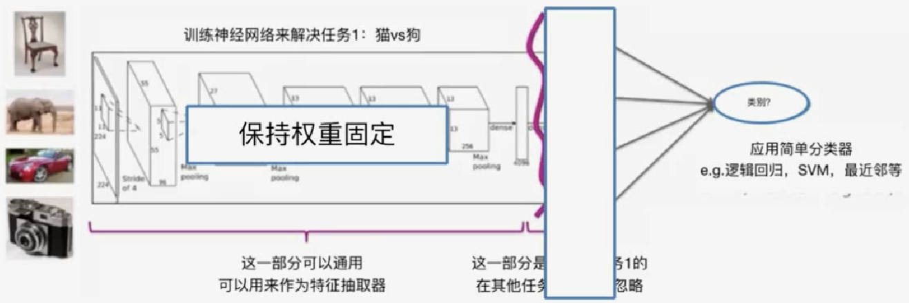

# Scikit-Learn Introduction

大纲:
- 回归模型: 数据→回归→智能, example: 房价预测
  - 线性回归
  - 多项式回归
- 分类模型: 数据→分类→智能, example: 情感分析
- 聚类模型: 数据→聚类→智能, example: wiki文本分析
- 推荐系统: 数据→协同过滤→智能, example: 音乐推荐系统
- 深度学习: 数据→深度学习→智能, example: 图像检索系统

Environment:
- pandas, scikit只能处理内存中的数据, 不能应用于大型的数据集
- sframe, graphlab create不仅能够处理内存中的数据集还可以处理大型数据集

## Regression model

example
- 房价:
  - 面积
  - 几室几厅
  - ...
- 学习成绩
  - 预习时间
  - 学习时间
  - 复习时间
  - 练习时间
- 股票价格
  - 近期股价
  - 新闻事件
  - 相关的商品
- 微博流行度
  - 粉丝数
  - 粉丝的粉丝数
  - 微博内容
  - 转发频率
- 预测房间空间某一点的温度
  - 现在的时间
  - 室外的温度
  - 其他传感器的温度
  - 通风口
  - ...

## classification

example
- 情感分析、评价打分
  - input: 文本内容
  - output: 正面、负面
- 新闻类别分类
  - input: 新闻内容
  - output: 新闻类别
- 垃圾邮件过滤
  - input: ip, sender, 邮件内容
  - output: 正常邮件、垃圾邮件
- 图像识别
  - input: pixel info
  - output: 名称
- 医疗诊断
  - input: 各种测试数据, DNA
  - output: 疾病种类
- 读懂正在想的内容
  - input: 核磁成像
  - outpu: 东西种类

阈值分类器: 统计正面和负面的单词个数
- if 正面个数>负面个数: 正面
- else: 负面

阈值分类器缺点:
- 无法区分单词不同程度: e.g. Great > Good
  - 通过学习分类器实现
- 单独的词语不够: e.g. not good
  - 通过更多特征解决

线性分类器:
- 对不同的单词加入权重，然后简单求和
  - if 求和>0: 正面
  - else: 负面

决策边界: 区分了正面和负面的预测
> 
- 两个非零权重，线性分类器，决策边界时直线
- 三个非零权重，线性分类器，决策边界时平面
- 多个非零权重，线性分类器，决策边界时超平面
- 多个非零权重，非线性分类器，决策边界时超曲面

分类器工作过程: 学习得到单词权重，然后用权重去预测测试集
>   
> 
- 测试集预测错误数/测试集总数= 误差
- 测试集预测正确数/测试集总数= 精度

精度的意义
- 对于二元分类器，随机猜测也有0.5的概率猜中，所以分类器预测精度应该>0.5，否则分类器毫无意义
- 对于k元分类器，模型预测精度应该>1/k
- 多数类预测要注意精度: e.g. 比如90%的邮件是垃圾邮件，那么将所有邮件预测为垃圾邮件，精度也能90%

二元混淆矩阵:
> 

二元混淆矩阵: 精度=对角线求和/总测试集
多元混淆矩阵: 精度=对角线求和/总测试集

学习曲线: 
- 一般数据量越多越好(数据质量是首要的)，但模型需要学习多少数据?
- 模型偏差的存在导致就算无穷的数据，模型偏差都不为0
- 复杂的模型需要更多的数据，模型偏差越小
> 

## Clustering

e.g. 根据现在阅读的文章，找到相似的感兴趣的文章
- 衡量文章相似度
- 对该文章进行如何搜索

词袋模型计算文档相似度：
- 词袋模型：忽略单词顺序，只是简单统计, 然后用一个统计向量(每个元素代表一个单词，元素的大小就是单词的计数)来描述
- 然后找一些其他文章，同样生成统计向量，将该统计向量与之前的进行**点乘**，数值越大，相似度越高

problem: 如果将两篇文章同时复制加到各自的末尾，文档长度变成2倍，点乘结果会更多，然而并不是更加相似
- 需要将统计向量归一化

problem: 如果文档出现生僻字，无法加入统计向量
- 关键词：局部常见(同一篇文档中反复出现)，全局罕见(所有文档中出现很少)
- 采用**TF-IDF**(逆向文档频率)方法解决: $log\frac{所有文档数目}{1+包含该词的文档数}$
  - 如果有一个词在所有文档都常见，那么该权重接近于0
  - 如果是一个生僻词，那么为了避免分母是0， 所以`+1`

K-mean:
- 初始化集群中心:Voronoi分割得到k个中心
- 然后调整中心位置(每个分区求平均)
- 每个区域不断计算与中心的距离，增加数据点或者减少数据点，重复上一个步骤，知道收敛

聚类其他应用:
- 组织网页搜索结果：搜索"狗",显示所有的狗
- 通过kmean估价相似条件的房子

## 推荐系统

个性化：链接用户和商品

推荐系统应用：
- 商品推荐
- 社交推荐
- 同一个药品推荐给其他的疾病

推荐方法：
1. 根据流行程度推荐(比如，热搜)，或者根据转发次数: 缺乏个性化
2. 根据用户信息预测
   > 
   缺点：用户没有填写某些特征;效果比不上协同过滤
3. 协同过滤：根据其他人买过的这个东西，然后推荐其他人大概率买过的东西给现在的用户

协同过滤:
- 同现矩阵: 对称矩阵，每个元素是购买的用户数
  > 
- 同现矩阵归一化(Jaccard)： 同时买i和j的用户数/(买i或买j的并集用户数); 局限在于仅关心当前行为，不关心历史行为
- 考虑历史记录: 比如历史买过a, b; 将所有商品c进行ac, bc进行Jaccard归一化计算相似度，然后对这两个求加权平均相似度(如果a,b购买有先后顺序，最近购买的权重更大)，挑出最大的进行推荐
- 还要考虑用户购买的时间段、用户特征、商品特征；
- 冷启动问题：新用户没有历史记录，新商品没有进入同现矩阵

电影推荐:
- 商品特征：每个电影各种类型成分(动作、戏剧、爱情...): R=[0.3, 0.01, 1.5,...]
- 用户特征：用户对各种类型(动作、戏剧、爱情...)喜爱程度向量: L=[2.5, 0, 0.8]
- 然后点乘，对用户没看过的电影按照点乘的结果排序
- 然后所有用户和所有电影构成一个矩阵
- 实际情况是反过来的，已知矩阵(用户打分矩阵，很多nan)，需要填充这个矩阵，用到**矩阵分解**；利用观测数据得到L, R; 然后利用L,R来做推荐
- 矩阵分解仍然无法解决冷启动的问题

有时候需要在不同模型进行切换(混合模型)，得到更好的推荐效果，结合特征解决冷启动问题
- 仅仅通过特征(性别、年龄)来估计新用户的评分(协同过滤)
- 当用户有足够的信息，采用矩阵分解来抓住行为相似的用户

衡量推荐系统性能：好的模型准确率和召回率都接近1，所以两者构成的坐标下面积越大，模型越好
- 召回率：推荐出的喜欢的商品/全部喜欢的商品
- 准确率：推荐出的喜欢的商品/全部推荐的商品

## Deep Learning

单层神经网络和线性分类器是一样的
> 

单层神经网络可以通过非输入节点不同的权重，实现逻辑OR, 逻辑AND运算，但是无法实现逻辑XOR(需要用到非线性特征)
> 

增加一层神经网络就可以实现逻辑XOR
> 

深度学习优势：
- 使得学习特征成为可能，而不是手动去调节特征
- 卓越的性能： 计算机视觉、语音识别、文本分析
- 潜在的更多影响

深度学习劣势：
- 需要大量数据
- 需要强大算力
- 难以调节模型
  - 架构选择
  - 参数类型
  - 元参数
  - 学习算法

深度特征：深度学习+迁移学习
> 

将任务A的最后一层换成其他分类器，来完成任务B
>   
>   
>   